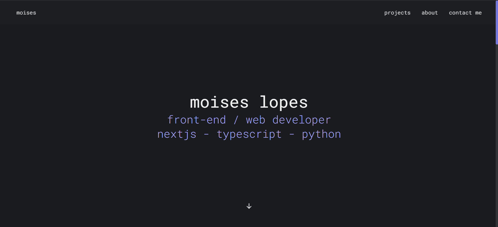

# moisesfolio - My portfolio
It's my personal portfolio! I really liked the result and hopefully you will too :]
You can visit it directly here: [moisesln.dev](https://moisesln.dev/)

<br>

## Installing the project locally
### Cloning the repo
```batch
git clone https://github.com/MoisesLN/moisesfolio.git
cd moisesfolio
```

### Installing dependencies
```batch
cd project
npm install
```

### Running the project
```batch
npm run dev
```
The project will then be running at [localhost:5173](http://localhost:5173/)
